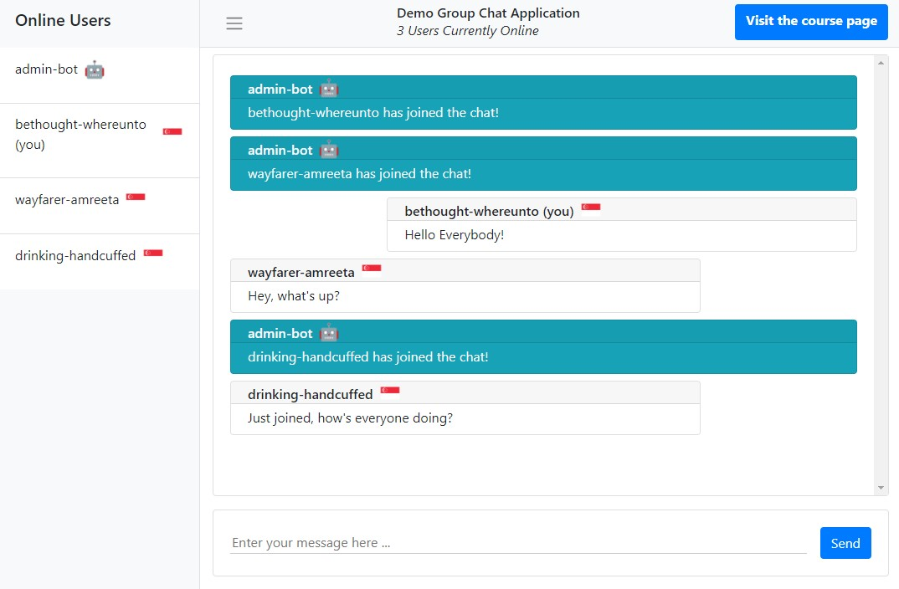

# Demo Group Chat Application 💬



## About

A simple group chat room to demonstrate usage of the WebSockets protocol, the browser WebSockets API and the node.js WebSockets library, which enables the user to send and receive messages in real-time.

## Features

-   Random (readable) username generated for users on login
-   Display user's origin country
-   Display usernames of all users in the room
-   Notifications when a user enter / leaves the room
-   Profanity filter - users cannot send messages containing profanity

## Deployment

A [Heroku](https://www.heroku.com) account and the [Heroku CLI](https://devcenter.heroku.com/articles/heroku-cli) is needed to deploy this application to Heroku. Docker is also required.

Log in to container registry
```console
$ heroku container:login
```

If you want to create a new Heroku app to deploy to, navigate to the app’s directory and create a Heroku app:
```console
$ heroku create
```

Alternatively, if there is already a Heroku app you want to add this to, add the remote to the repository:
```console
$ heroku git:remote -a your-app-name
```

Build the image and push to Container Registry:
```console
$ heroku container:push web
```

Then release the image to your app:
```console
$ heroku container:release web
```


[IAP notes on deployment to Heroku](https://realtime-apps-iap.github.io/docs/introduction/deployment-to-heroku)
[Article on deploying docker images to Heroku](https://devcenter.heroku.com/articles/container-registry-and-runtime)

